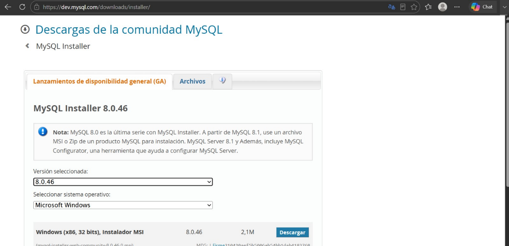
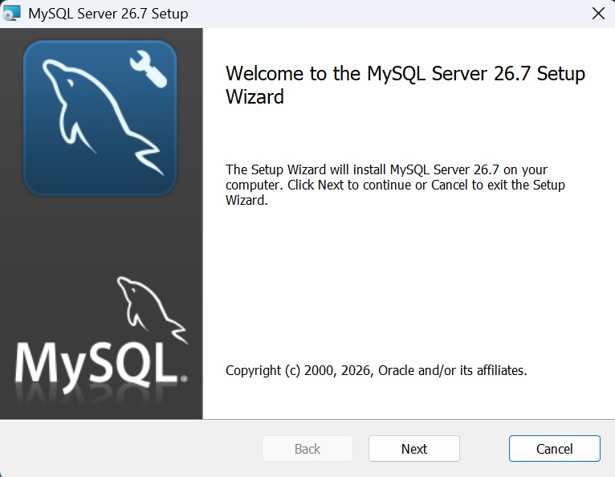
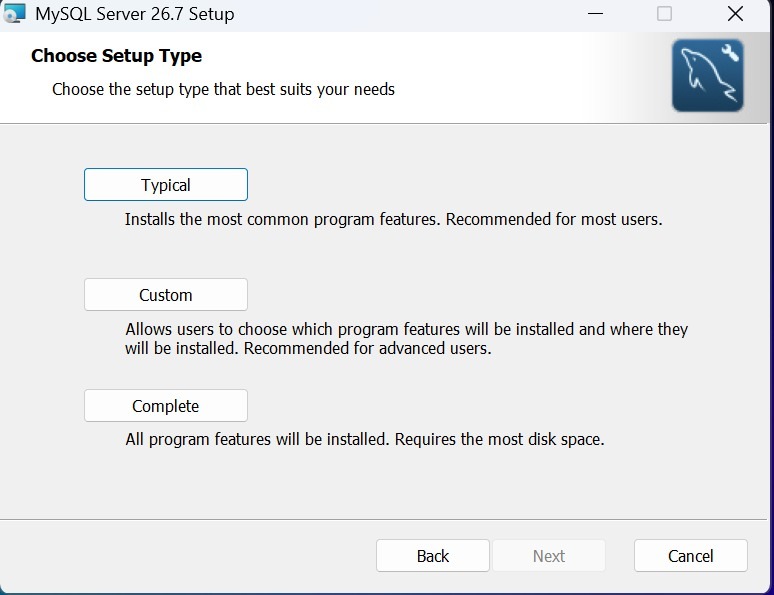
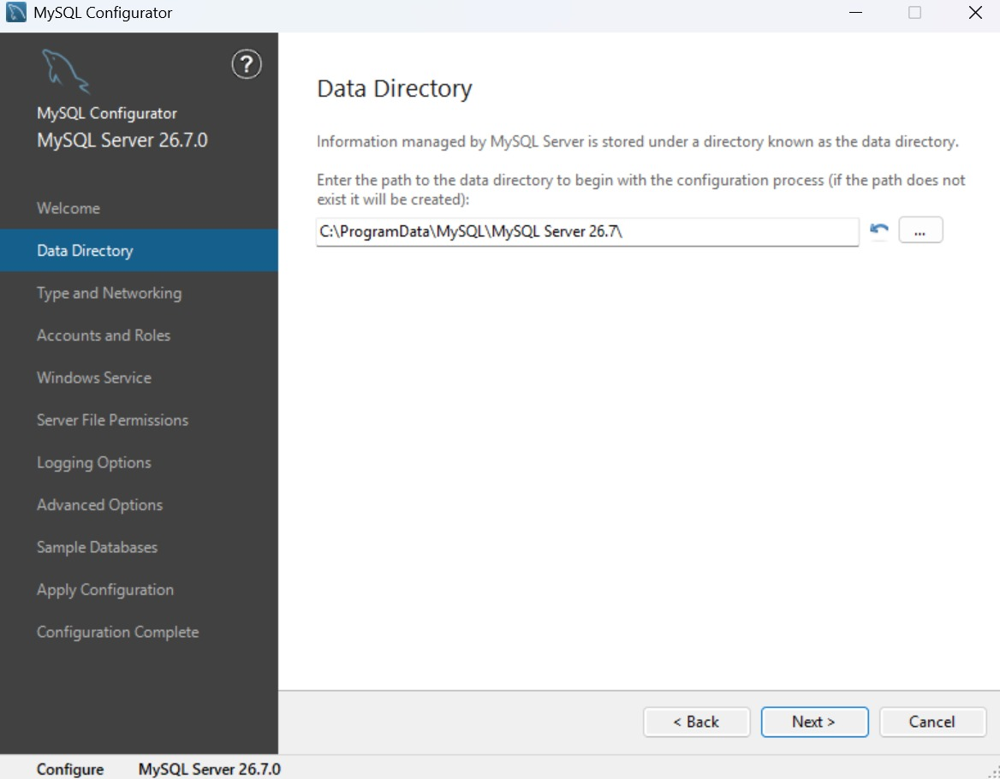
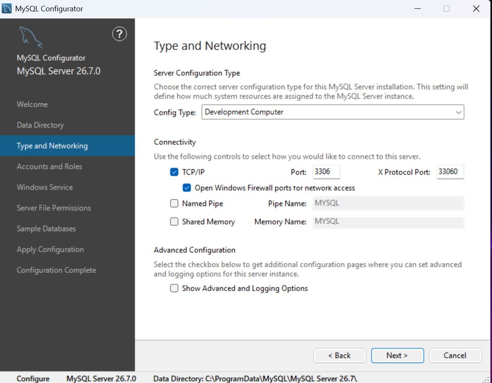
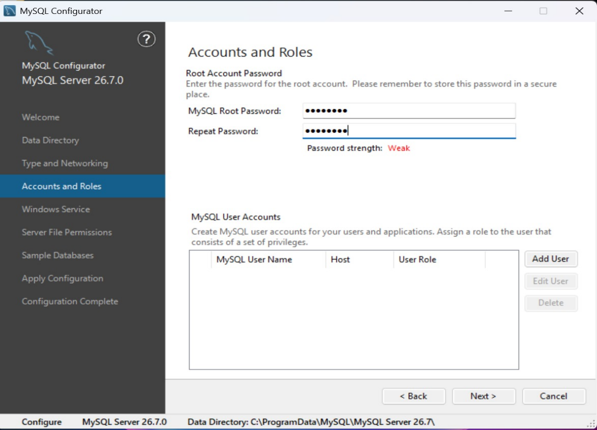
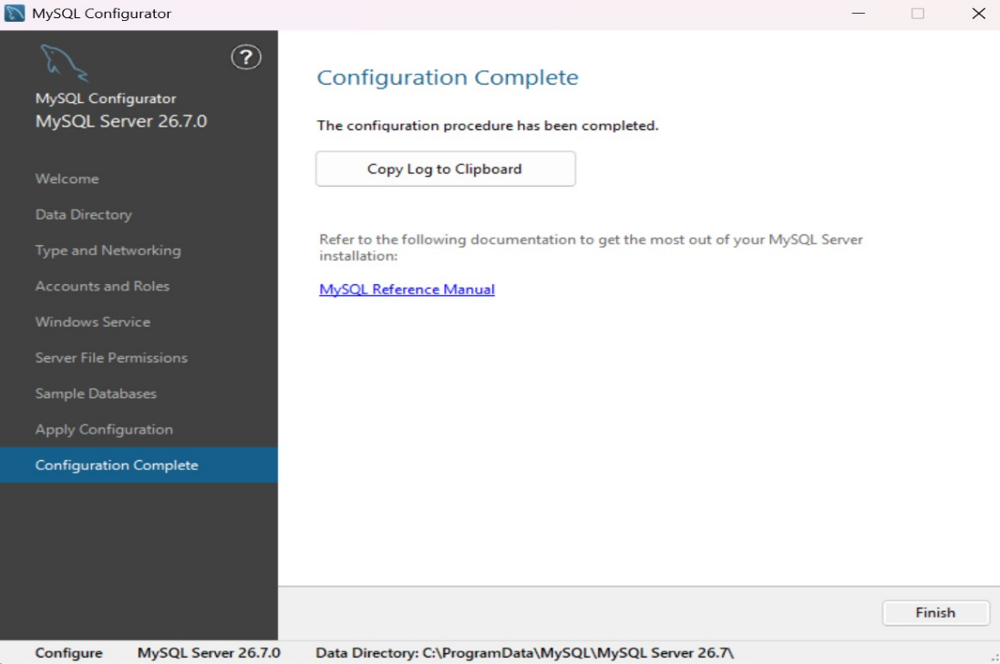
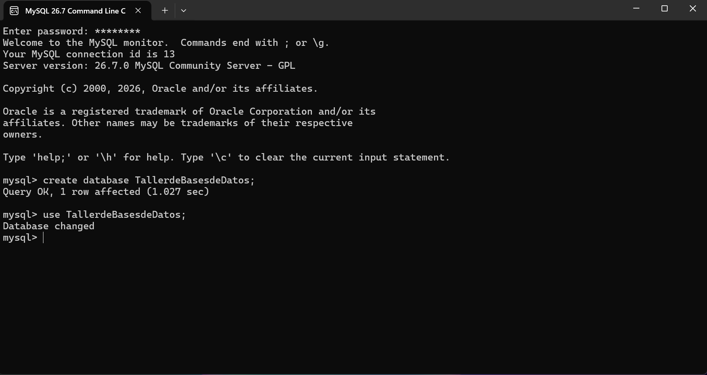

# Instalación de MySQL

## Introducción

MySQL es un gestor de bases de datos que permite almacenar, organizar y administrar información de manera eficiente. Es una de las herramientas más utilizadas en el ámbito de la informática debido a que facilita el manejo de grandes cantidades de datos y permite realizar consultas, modificaciones y actualizaciones de forma rápida y segura.

Actualmente, el manejo de bases de datos es una parte fundamental de la tecnología, ya que la mayoría de los sistemas informáticos dependen de ellas para guardar y procesar información. Por esta razón, conocer herramientas como MySQL resulta importante para cualquier estudiante o profesional relacionado con el área de la informática.

En esta práctica se llevó a cabo la instalación de MySQL en un equipo de cómputo, siguiendo los pasos necesarios para su correcta configuración. Durante el proceso se realizaron actividades como la descarga del software, la instalación de sus componentes principales y la configuración inicial del servidor. Asimismo, se verificó su funcionamiento mediante pruebas básicas.

El objetivo de esta práctica fue familiarizarse con el proceso de instalación y configuración de MySQL.

## Instalación de MySQL

### 4.1 Descarga del instalador

El primer paso consistió en acceder al sitio oficial de MySQL para descargar el instalador que permite configurar el servidor y las herramientas necesarias para trabajar con bases de datos.

En la página de descargas se seleccionó la versión **"MySQL Installer 8.0.46"** para el sistema operativo **"Microsoft Windows"**.

Enlace de descarga: <https://dev.mysql.com/downloads/file/?id=556533>

**Figura 1.** Página oficial de descargas de MySQL Community Installer

### 4.2 Inicio del asistente de instalación

Una vez descargado el instalador, se ejecutó el archivo correspondiente para iniciar el proceso de instalación de MySQL. Al abrirse el asistente de instalación, se mostró la ventana de bienvenida, en la cual se informa que el programa instalará MySQL Server en el equipo.

Para continuar con el proceso se seleccionó la opción **"Next"**, lo que permitió avanzar a las siguientes etapas de configuración e instalación.

**Figura 2.** Pantalla de bienvenida del asistente de instalación de MySQL

### 4.3 Selección del tipo de instalación

Después de iniciar el asistente de instalación, se mostró una ventana para seleccionar el tipo de instalación que se desea realizar. El instalador ofrece tres opciones:

- **Typical:** Instala las características más comunes del programa y es la opción recomendada para la mayoría de los usuarios.
- **Custom:** Permite seleccionar manualmente los componentes y la ubicación de instalación.
- **Complete:** Instala todos los componentes disponibles, requiriendo mayor espacio en disco.

Para esta práctica se seleccionó la opción **Typical**, ya que incluye los componentes necesarios para trabajar con MySQL de manera adecuada.

**Figura 3.** Selección del tipo de instalación de MySQL

### 4.4 Configuración del directorio de datos

Después de seleccionar el tipo de instalación, se abrió el configurador de MySQL Server. En esta etapa se especificó la ubicación donde se almacenarán los archivos y bases de datos administrados por MySQL.

El instalador asignó de forma predeterminada la ruta.

**Figura 4.** Configuración del directorio de datos de MySQL Server

Se mantuvo la configuración predeterminada recomendada por el asistente de instalación y posteriormente se seleccionó la opción **Next** para continuar con el proceso.

### 4.5 Configuración del tipo de servidor y red

En esta etapa se configuraron los parámetros de funcionamiento del servidor MySQL. Se seleccionó la opción **"Development Computer"**, la cual está diseñada para equipos utilizados con fines de desarrollo, asignando los recursos necesarios sin afectar significativamente el rendimiento general del sistema.

También se habilitó la conexión mediante el protocolo **"TCP/IP"**, utilizando el puerto predeterminado **"3306"**, que es el puerto estándar de MySQL.

Una vez verificados los valores de configuración, se seleccionó la opción **Next** para continuar con el proceso de instalación.

**Figura 5.** Configuración del tipo de servidor y parámetros de red

### 4.6 Configuración de cuentas y roles

En esta etapa se configuró la cuenta principal de administración del servidor MySQL, conocida como **root**. Para ello, se ingresó una contraseña y se confirmó nuevamente para garantizar que el acceso al sistema estuviera protegido.

La cuenta **"root"** posee privilegios administrativos sobre el servidor, por lo que es importante elegir una contraseña segura. Esta contraseña no debe olvidarse, ya que será necesaria cada vez que se desee acceder al servidor MySQL para administrar bases de datos, realizar consultas o generar cambios en la configuración.

**Figura 6.** Configuración de la contraseña del usuario root y administración de cuentas de MySQL

### 4.7 Finalización de la configuración

Después de aplicar todas las configuraciones establecidas durante el proceso de instalación, el asistente mostró la ventana **"Configuration Complete"**, indicando que la configuración de MySQL Server se completó correctamente.

Una vez verificado que no existían errores en el proceso, se seleccionó la opción **"Finish"** para finalizar el asistente de configuración.

**Figura 7.** Finalización satisfactoria de la instalación y configuración de MySQL Server

### 4.8 Verificación del funcionamiento de MySQL

Una vez concluida la instalación y configuración del servidor, se realizó una prueba de funcionamiento utilizando la consola de comandos de MySQL. Para acceder al sistema se ingresó la contraseña previamente configurada.

Después de iniciar sesión correctamente, se comprobó el funcionamiento del servidor mediante la creación de una nueva base de datos llamada **"TallerdeBasesdeDatos"**. Posteriormente, se seleccionó dicha base de datos para trabajar sobre ella. Los mensajes mostrados por el sistema confirmaron que la operación se realizó exitosamente.

**Figura 8.** Comprobación del correcto funcionamiento de MySQL mediante la creación y selección de una base de datos

## Conclusión

La práctica de instalación de MySQL permitió conocer el proceso necesario para poner en funcionamiento un sistema gestor de bases de datos, desde la descarga del instalador hasta la configuración final del servidor. Durante la instalación se configuraron aspectos importantes como el directorio de almacenamiento, los parámetros de red y la contraseña del usuario administrador.

Una vez finalizada la instalación, se comprobó que MySQL funcionaba correctamente mediante la creación y el uso de una base de datos de prueba. Esto permitió verificar que el servidor quedó listo para trabajar y almacenar información de manera adecuada.

La práctica fue muy útil para comprender el funcionamiento básico de MySQL y adquirir conocimientos fundamentales que servirán como base para futuras actividades relacionadas con bases de datos, programación y desarrollo de aplicaciones.

## Referencias

- Oracle Corporation. *Instalador MySQL para Windows*. Disponible en: <https://dev.mysql.com/downloads/installer/>
- Tutorial MySQL. *Instala MySQL*. Disponible en: <https://tutorialmysql.org/introduccion/instalar-mysql>
- MySQL YA. *Comandos esenciales en MySQL y herramientas*. Disponible en: <https://mysqlya.com.ar/bases-de-datos/comandos-base-de-datos-mysql/>
