# Instalación de PostgreSQL y pgAdmin 4

## Introducción

El manejo de bases de datos es una habilidad fundamental para cualquier estudiante o profesional del área de Sistemas Computacionales, ya que la mayoría de las aplicaciones modernas requieren almacenar, consultar y administrar información de manera estructurada. Entre los sistemas gestores de bases de datos relacionales más utilizados en el ámbito académico y profesional se encuentra PostgreSQL, un motor de bases de datos de código abierto reconocido por su robustez, escalabilidad y cumplimiento con el estándar SQL.

A diferencia de otros motores de bases de datos, PostgreSQL se distingue por ser completamente gratuito y de código abierto, lo que permite a estudiantes e instituciones educativas utilizarlo sin restricciones de licenciamiento. Además, su comunidad activa de desarrollo garantiza actualizaciones constantes en materia de seguridad, rendimiento y nuevas funcionalidades, lo que lo convierte en una herramienta vigente tanto para el aprendizaje académico como para su aplicación en entornos productivos reales.

Conocer el proceso de instalación de un sistema gestor de bases de datos es el primer paso indispensable antes de poder diseñar, crear y administrar bases de datos relacionales. Una instalación correcta garantiza que el servidor quede configurado con los parámetros adecuados (puerto de escucha, credenciales del superusuario, directorio de datos, entre otros), evitando problemas posteriores durante el desarrollo de las prácticas de la asignatura.

El presente reporte documenta, paso a paso, el proceso de instalación de PostgreSQL en su versión 18 sobre el sistema operativo Windows, así como la instalación de pgAdmin 4, su herramienta gráfica oficial de administración. Se incluyen capturas de pantalla de cada etapa del proceso, desde la descarga del instalador hasta la verificación de la conexión al servidor recién creado, con el fin de dejar evidencia clara y replicable de la práctica realizada. Como apoyo complementario para la realización de esta práctica se consultó un video tutorial disponible en YouTube, el cual se incluye en la sección de referencias.

## Información del proyecto

PostgreSQL es un sistema gestor de bases de datos relacional y orientado a objetos, de código abierto, desarrollado y mantenido por una comunidad global de colaboradores. Se caracteriza por su alto grado de conformidad con el estándar SQL, su extensibilidad y su capacidad para manejar cargas de trabajo que van desde pequeñas aplicaciones hasta sistemas empresariales de gran escala.

Para esta práctica se instaló la versión 18 de PostgreSQL junto con pgAdmin 4 (v9.17), la interfaz gráfica que permite administrar servidores, bases de datos, roles y consultas SQL sin necesidad de usar exclusivamente la línea de comandos.

**Datos generales de la instalación**

| Parámetro | Valor |
|---|---|
| Software instalado | PostgreSQL 18 y pgAdmin 4 v9.17 |
| Sistema operativo | Windows |
| Proveedor del instalador | EDB (EnterpriseDB) / postgresql.org |
| Puerto configurado | 5432 (por defecto) |
| Usuario superadministrador | postgres |
| Directorio de instalación | `C:\Program Files\PostgreSQL\18` |
| Directorio de datos | `C:\Program Files\PostgreSQL\18\data` |
| Configuración regional | DEFAULT |

*Fuente: Elaboración propia*

## Proceso de instalación

### 4.1 Descarga de PostgreSQL

El instalador de PostgreSQL para Windows se obtiene de forma gratuita desde el sitio oficial del proyecto (postgresql.org), el cual redirige a los paquetes distribuidos por EDB. En estas páginas se puede elegir la versión de PostgreSQL y la plataforma de destino antes de descargar el instalador.

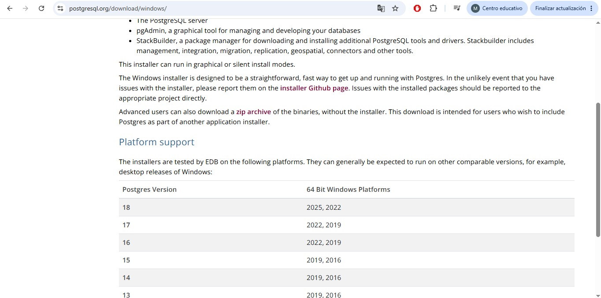

**Figura 1.** Página oficial de descargas de PostgreSQL (postgresql.org) mostrando las versiones soportadas para Windows.

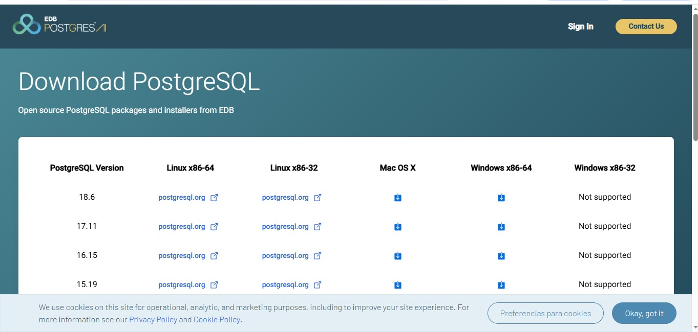

**Figura 2.** Tabla de descargas de EDB con los instaladores de PostgreSQL disponibles por versión y plataforma.

### 4.2 Instalación de PostgreSQL

Al ejecutar el instalador descargado se inicia un asistente que guía paso a paso la configuración del servidor: directorio de instalación, componentes a instalar, directorio de datos, contraseña del superusuario, puerto de escucha y configuración regional del clúster.

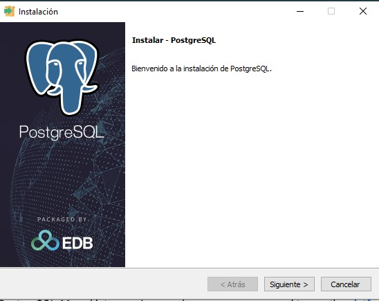

**Figura 3.** Pantalla de bienvenida del asistente de instalación de PostgreSQL.

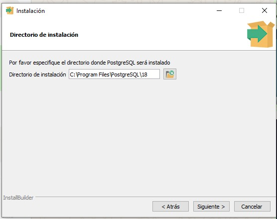

**Figura 4.** Selección del directorio de instalación de PostgreSQL.

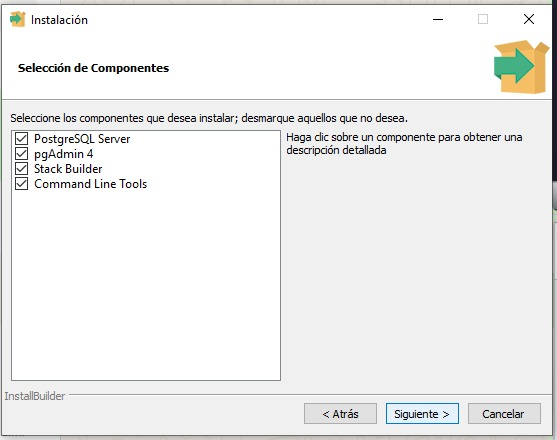

**Figura 5.** Selección de componentes a instalar: PostgreSQL Server, pgAdmin 4, Stack Builder y Command Line Tools.

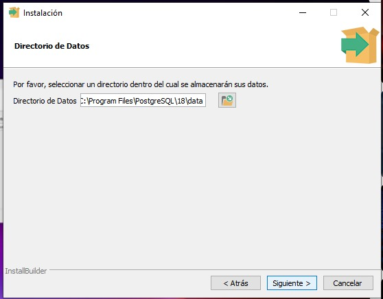

**Figura 6.** Configuración del directorio donde se almacenarán los datos del clúster de base de datos.

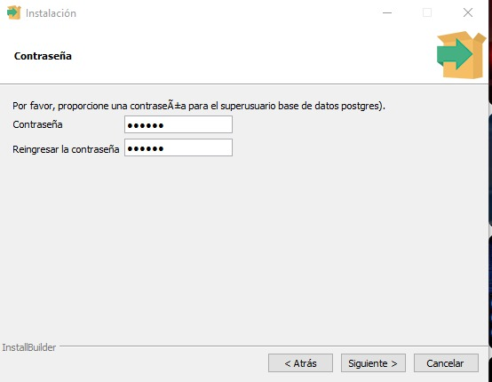

**Figura 7.** Asignación de la contraseña para el superusuario 'postgres'.

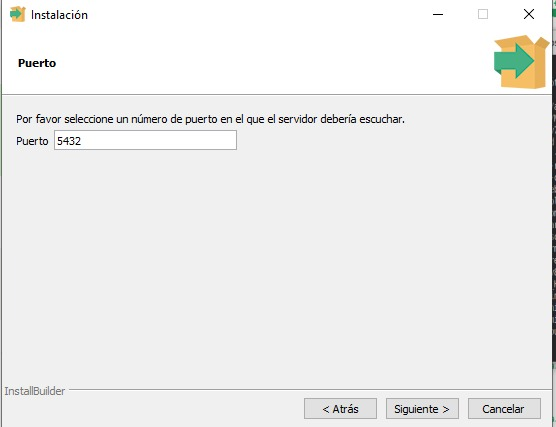

**Figura 8.** Configuración del puerto en el que escuchará el servidor (5432 por defecto).

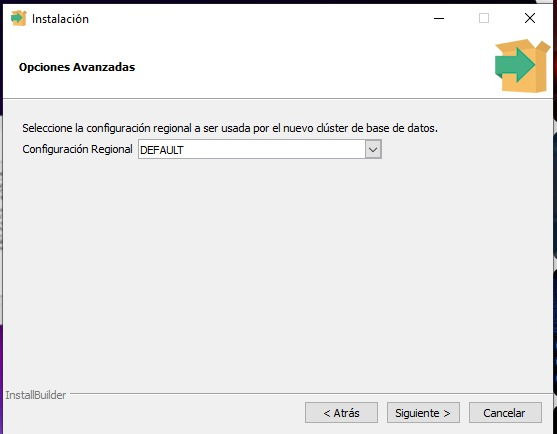

**Figura 9.** Selección de la configuración regional (locale) del nuevo clúster de base de datos.

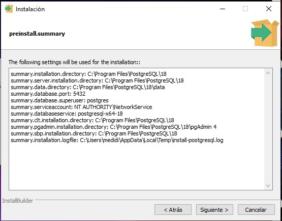

**Figura 10.** Resumen previo a la instalación con los parámetros configurados (directorios, puerto, cuenta de servicio, etc.).

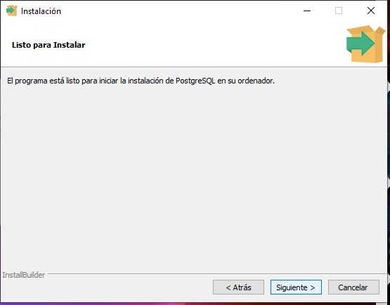

**Figura 11.** Pantalla de confirmación 'Listo para Instalar'.

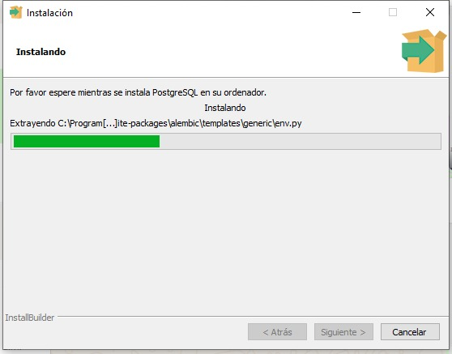

**Figura 12.** Progreso de la instalación de PostgreSQL en el equipo.

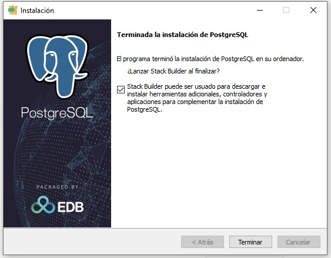

**Figura 13.** Finalización de la instalación de PostgreSQL, con la opción de lanzar Stack Builder.

### 4.3 Descarga e instalación de pgAdmin 4

pgAdmin 4 es la herramienta gráfica oficial para administrar servidores PostgreSQL. Aunque el instalador de PostgreSQL ya incluye la opción de instalarla, en esta práctica también se descargó e instaló de forma independiente desde el repositorio oficial de archivos de pgAdmin.

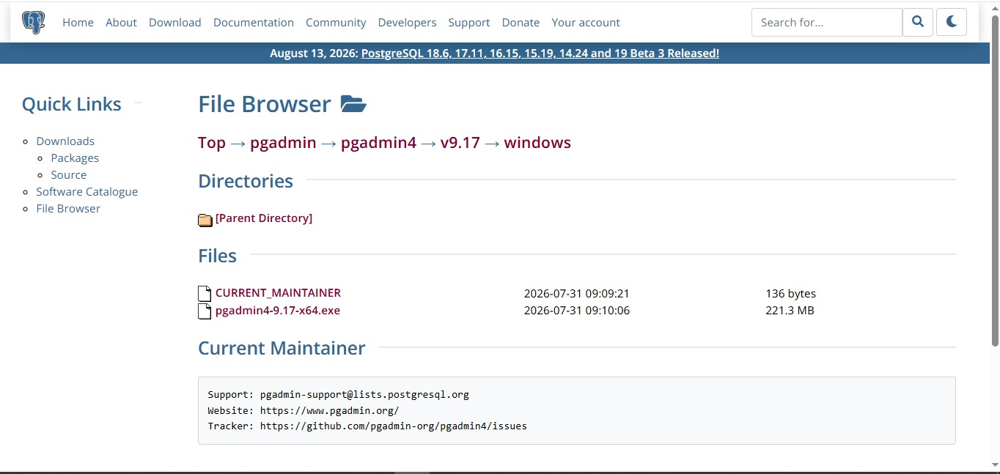

**Figura 14.** Explorador de archivos del sitio oficial de pgAdmin, con el instalador de pgAdmin 4 v9.17 para Windows.

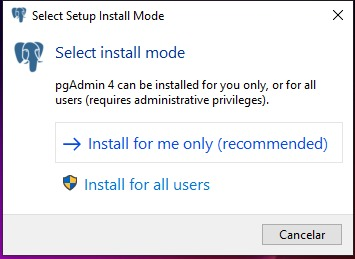

**Figura 15.** Selección del modo de instalación de pgAdmin 4 (para el usuario actual o para todos los usuarios).

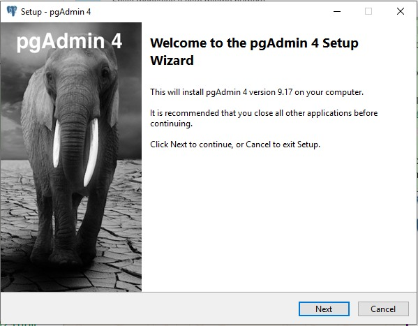

**Figura 16.** Pantalla de bienvenida del asistente de instalación de pgAdmin 4.

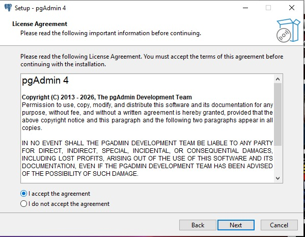

**Figura 17.** Acuerdo de licencia de pgAdmin 4.

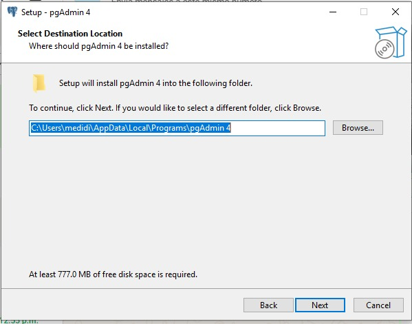

**Figura 18.** Selección de la carpeta de destino para la instalación de pgAdmin 4.

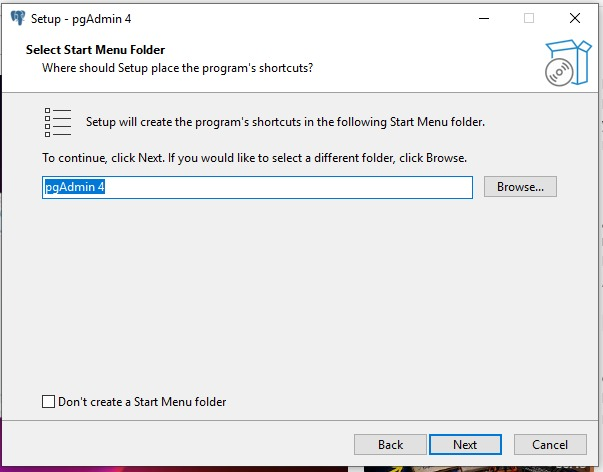

**Figura 19.** Selección de la carpeta del menú Inicio para los accesos directos de pgAdmin 4.

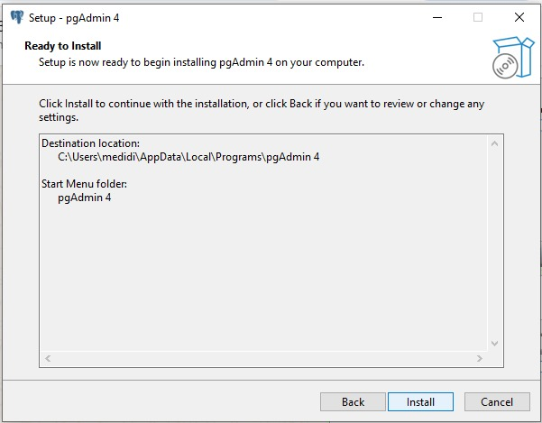

**Figura 20.** Pantalla 'Ready to Install' previa a la instalación de pgAdmin 4.

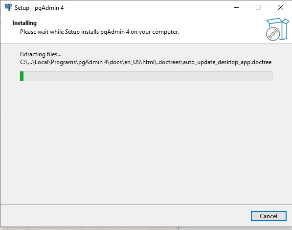

**Figura 21.** Progreso de la instalación de pgAdmin 4 (extracción de archivos).

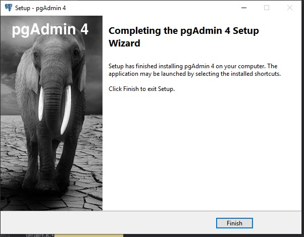

**Figura 22.** Finalización del asistente de instalación de pgAdmin 4.

### 4.4 Registro del servidor y verificación

Una vez instalado pgAdmin 4, se registró el servidor local proporcionando el host, el puerto, la base de datos de mantenimiento y las credenciales del superusuario 'postgres'. Al conectarse correctamente, el panel (Dashboard) de pgAdmin muestra la actividad del servidor PostgreSQL 18 en tiempo real, confirmando que la instalación se realizó con éxito.

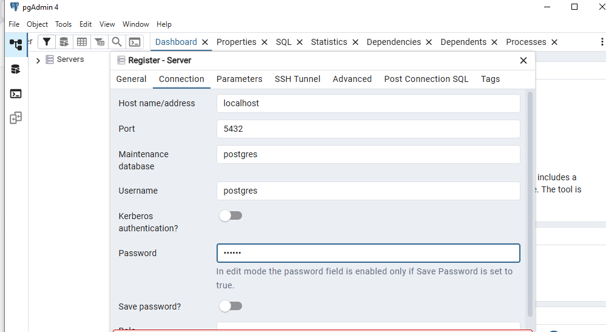

**Figura 23.** Registro de un nuevo servidor en pgAdmin 4, configurando host, puerto, usuario y contraseña.

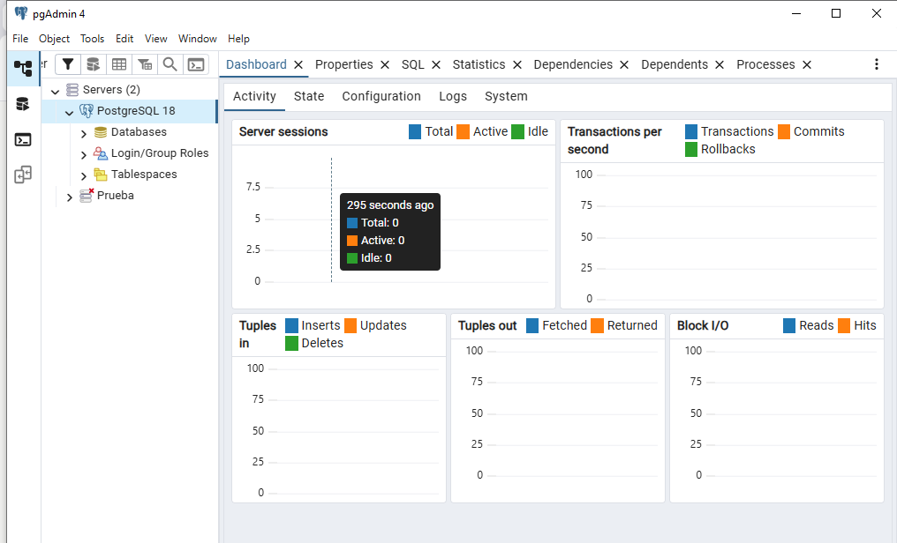

**Figura 24.** Panel (Dashboard) de pgAdmin 4 mostrando el servidor PostgreSQL 18 conectado correctamente.

## Conclusión

A través de esta práctica se logró instalar y configurar de manera exitosa el sistema gestor de bases de datos PostgreSQL 18 junto con su herramienta de administración gráfica pgAdmin 4 en un entorno Windows. El proceso permitió comprender los parámetros clave que se deben definir durante una instalación de este tipo, como el directorio de instalación, el directorio de datos, la contraseña del superusuario, el puerto de escucha y la configuración regional del clúster, elementos que influyen directamente en el correcto funcionamiento del servidor.

Durante el desarrollo de la práctica también se identificó la importancia de seguir cada paso del asistente de instalación con atención, ya que un descuido en la configuración inicial (por ejemplo, olvidar la contraseña del superusuario o modificar el puerto sin necesidad) puede generar complicaciones al momento de conectarse al servidor más adelante. Asimismo, se reforzó la diferencia entre PostgreSQL como motor de base de datos (que trabaja principalmente en segundo plano) y pgAdmin 4 como la interfaz gráfica que facilita su administración, consulta y monitoreo sin depender exclusivamente de la línea de comandos.

La verificación final, realizada mediante el registro del servidor en pgAdmin 4 y la visualización del panel de actividad (Dashboard), confirmó que el servicio de base de datos quedó correctamente instalado, en ejecución y disponible para su uso. Esto no solo valida el éxito de la instalación, sino que también sienta una base sólida y confiable para el desarrollo de futuras prácticas relacionadas con el diseño, la creación, la manipulación y la administración de bases de datos relacionales dentro de la asignatura.

En términos generales, esta práctica reafirma la importancia de dominar el proceso de instalación de un sistema gestor de bases de datos como paso previo indispensable antes de avanzar hacia temas más complejos, como el modelado de datos, la normalización, la creación de esquemas y la implementación de consultas SQL avanzadas.

## Referencias

- PostgreSQL Global Development Group. (2026). *Download PostgreSQL for Windows*. Recuperado de <https://www.postgresql.org/download/windows/>
- EDB (EnterpriseDB). (2026). *Download PostgreSQL*. Recuperado de <https://www.enterprisedb.com/downloads/postgres-postgresql-downloads>
- pgAdmin Development Team. (2026). *pgAdmin 4 – File Browser*. Recuperado de <https://www.pgadmin.org/download/pgadmin-4-windows/>
- Canal de YouTube. (s.f.). *Instalación de PostgreSQL y pgAdmin 4 en Windows* [Video]. Recuperado de <https://www.youtube.com/watch?v=GPAreqDIAnI>
